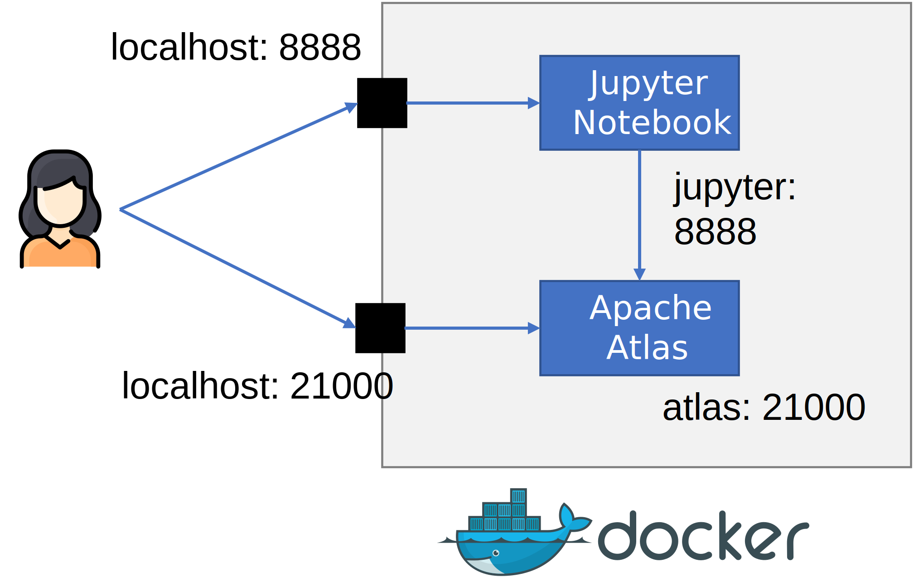

# WARC files metadata management using Apache Atlas

The objective of the tutorial is to show you:

* How to extract metadata from WebArchive (WARC) files.
* Manage WARC metadata using [Apache Atlas](http://atlas.apache.org/).

The tutorial is divided into 2 parts. **This part focuses on preparing the tutorial execution environment**.

## Requirements

* [Docker Engine](https://docs.docker.com/engine/install/) (included in [Docker Desktop](https://docs.docker.com/desktop/))
* [LIFRANUM](https://github.com/javieraespinosa/lifranum) github repository

_Provided as Docker images:_

* [Webarchive-discovery 3.1.0](https://github.com/ukwa/webarchive-discovery)
* [Apache Atlas 2.1.0](http://atlas.apache.org/2.1.0)
* [JupyterLab](https://jupyterlab.readthedocs.io/en/stable/)

## Environment Overview

The figure below gives an overview of the tutorial's execution environment.

The environment is composed of two docker containers:

* The `atlas` container running **Apache Atlas** (accessible at <http://localhost:21000>).
* The `jupyter` container running a **Jupyter Notebook** server (accessible at <http://localhost:8888/>).

All the tutorial dependencies have been installed in the `jupyter` container, so there is no need to install any extra dependencies for running the [tutorial's notebook](atlas-tutorial2.ipynb).

Also, note that `jupyter` acts as a proxy for interacting with `atlas` (i.e., metadata operations are executed via `jupyter` towards `atlas`). You can, however, visually explore the `atlas` content using the **Atlas WebUI** (<http://localhost:21000>).



## Preparing the Environment

Clone the [LIFRANUM repository](https://github.com/javieraespinosa/lifranum) and move to the `tutorials/` folder:

```sh
git clone https://github.com/javieraespinosa/lifranum.git
cd lifranum/tutorials
```

Inside `lifranum/tutorials`, build and pull the required docker images as follows:

```sh
# build jupyter using .Dockerfile
docker-compose -f atlas-tutorial2.yml build

# pull atlas from dockerhub
docker-compose -f atlas-tutorial2.yml pull
```

Run `atlas` and `jupyter` containers:

```sh
docker-compose -f atlas-tutorial2.yml up
```

At this point, you should be able to access the atlas and jupyter servers:

* **Apache Atlas**: <http://localhost:21000>.
* **Jupyter Notebook**: <http://localhost:8888>.

> Atlas can take up to 1 min to start

## Start the Tutorial

Once `jupyter`is up, open the [tutorial's notebook](atlas-tutorial2.ipynb) for continuing with the tutorial second part.

## Troubleshooting

Sometimes Atlas displays an error message. If that happens:

* Stop the containers: `ctr+c`.
* Remove and recreate the containers:

```sh
docker-compose -f atlas-tutorial2.yml down
docker-compose -f atlas-tutorial2.yml up
```

## Uninstalling

Run the following instruction if you want to free the space used by Docker for this tutorial:

```sh
docker-compose -f atlas-tutorial2.yml down --volumes --rmi all
```
